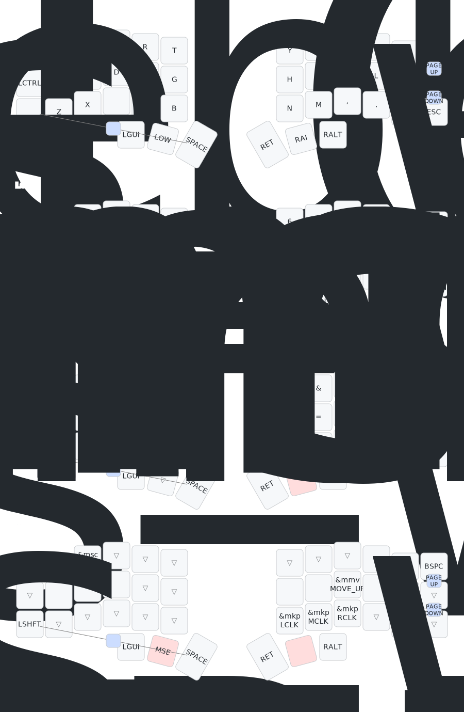

 

# 👨🏾‍💻@lucasmonteiroi - ZMK Config
This repository contains the configuration files for my Corne ZMK keyboard using the [nice_nano_v2 controller](https://nicekeyboards.com/nice-nano/).

> [!WARNING]
>
> This repo is 🚧 **_under development_** 🚧, I am not responsible for any problems, crashes or issues that you may have by copying and using this.

## Keyboard

My keyboard is a [corne-style split keyboard](https://github.com/foostan/crkbd) and I'm using the [zmk](https://zmk.dev/) firmware, made by: [@tupinikeebs](https://www.instagram.com/tupinikeebs/).

| **Board**        | **Switches**    | **Keycaps**     | **Case**        | **Last Change**        |
|--------------|-------------|-------------|-------------|-------------|
| Corne v2      | Akko Blue (45gf, tactile lubed )      | Cherry Black      | Void      | 27-03-2025      |

    
📸 If you want to see some photos about actual style, expand here!

### Corne Keymap
> [!INFORMATION]
>
> Drawn with [@caksoylar's Keymap Drawer](https://github.com/caksoylar/keymap-drawer)

## Dependencies

- [zmk-nice-oled](https://github.com/mctechnology17/zmk-nice-oled): A library for controlling the OLED display.
- [keymap-drawer](https://github.com/caksoylar/keymap-drawer): I've added this workflow visualize the keymap as an image.

## Resources

- [ZMK Firmware GitHub](https://github.com/zmkfirmware/zmk)
- [ZMK Documentation](https://zmk.dev/docs)
- [@caksoylar's Keymap Drawer](https://github.com/caksoylar/keymap-drawer)

## Inspirations

- [minusfive](https://github.com/minusfive/zmk-config)
- [mctechnology17](https://github.com/mctechnology17/zmk-config)
